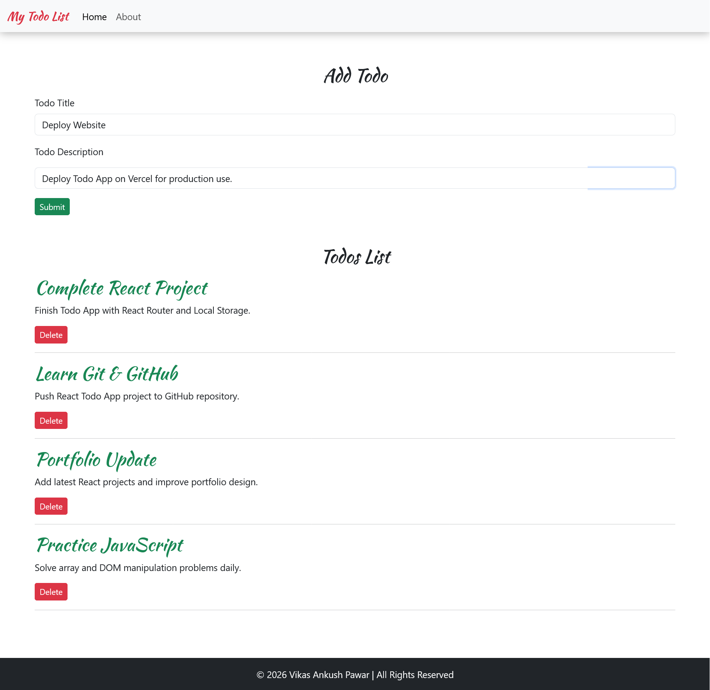
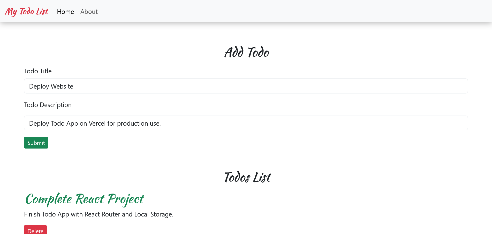

# React Todo App

A modern and responsive Todo List application built using React.js, Bootstrap, and React Router.

---

## 🚀 Live Demo

👉 https://vikasp-sw.github.io/react-todo-app/

---

## 📸 Screenshots

### 💻 Desktop View


### 📱 Mobile View


---

## ✨ Features

- Add new todos
- Delete todos
- Persistent data using Local Storage
- Fully responsive UI (mobile + desktop)
- React Router navigation (/ and /about)
- Modern Bootstrap 5 design
- Fixed navbar + footer layout

---

## 🛠️ Technologies Used

- React.js
- JavaScript (ES6+)
- Bootstrap 5
- React Router DOM
- CSS3
- Local Storage API

---

## 📦 Installation & Setup

Clone the repository:

```bash
git clone https://github.com/VikasP-SW/react-todo-app.git

Go to project directory:

cd react-todo-app

Install dependencies:

npm install

Run development server:

npm start
🏗️ Build for Production
npm run build
🚀 Deployment (GitHub Pages)
npm run deploy
📁 Project Structure
src/
 ├── MyComponents/
 │   ├── AddTodo.js
 │   ├── TodoItem.js
 │   ├── Todos.js
 │   ├── Header.js
 │   ├── Footer.js
 │   └── About.js
 ├── App.js
 ├── App.css
 ├── index.js
👨‍💻 Author

Vikas Ankush Pawar

GitHub: https://github.com/VikasP-SW
LinkedIn: https://www.linkedin.com/in/vikaspawar-dev
⭐ Support

If you like this project, give it a ⭐ on GitHub!


---

Agar chaho next step me main tumhe **:contentReference[oaicite:0]{index=0}** bhi bana dunga 😎


